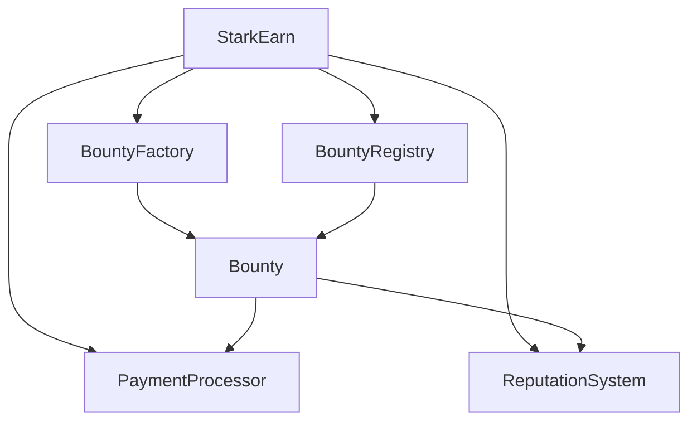

# StarkEarn Smart Contract System

StarkEarn is a decentralized bounty platform built on StarkNet that allows users to create, fund, and complete bounties using smart contracts.

## Contract Architecture

The StarkEarn system consists of several interconnected contracts:

### Core Contracts

1. **BountyRegistry** - Main registry for all bounties
   - Maintains a list of all bounty addresses
   - Provides search and filtering capabilities
   - Tracks global statistics

2. **BountyFactory** - Factory contract for creating new bounties
   - Creates new bounty contracts using the clone pattern for gas efficiency
   - Sets initial parameters
   - Registers new bounties in the BountyRegistry

3. **Bounty** - Individual bounty contract
   - Each bounty has its own contract instance
   - Manages bounty details, applications, submissions, and payments
   - Handles the complete lifecycle of a bounty

4. **PaymentProcessor** - Handles payments and escrow
   - Manages token escrow for bounty rewards
   - Distributes payments to bounty hunters
   - Processes refunds to creators
   - Collects platform fees

5. **ReputationSystem** - Manages user reputation scores
   - Tracks reputation for both creators and hunters
   - Updates scores based on bounty completion
   - Provides reputation-based access controls

6. **StarkEarn** - Main entry point contract
   - Integrates all core contracts
   - Provides a unified interface for system interactions

### Library

- **stark_earn_lib** - Common data structures, interfaces, and utilities

## Contract Interactions



## Key Features

### Bounty Management
- Create bounties with custom rewards, deadlines, and requirements
- Application and acceptance process for hunters
- Work submission and approval workflow
- Automatic payment distribution upon completion

### Payment System
- Secure escrow for bounty rewards
- Platform fee collection
- Refund mechanism for cancelled bounties
- Support for multiple token standards

### Reputation System
- Reputation scores for creators and hunters
- Reputation-based access controls
- Quality-based reputation adjustments
- Minimum reputation requirements for actions

## Getting Started

### Prerequisites
- Scarb (Cairo package manager)
- StarkNet development environment

### Installation
1. Clone the repository
2. Install dependencies with `scarb build`
3. Deploy contracts in the following order:
   1. BountyRegistry
   2. PaymentProcessor
   3. ReputationSystem
   4. Bounty (as template)
   5. BountyFactory
   6. StarkEarn (main contract)

### Deployment
1. Deploy the Bounty contract as a template for cloning
2. Deploy core contracts with appropriate constructor parameters
3. Initialize the StarkEarn contract with core contract addresses
4. Set up permissions and configurations

## Usage

### Creating a Bounty
1. Call `create_bounty` on the StarkEarn contract
2. Funds are automatically escrowed in PaymentProcessor
3. Bounty is registered in BountyRegistry

### Applying for a Bounty
1. Submit application to the specific Bounty contract
2. Creator reviews and accepts applications
3. Bounty status changes to InProgress

### Completing a Bounty
1. Hunter submits work to Bounty contract
2. Creator reviews and approves submission
3. Payment is automatically distributed
4. Reputation is updated for both parties

## Security Considerations

- All contracts implement access control checks
- Funds are held in escrow until completion
- Reputation system prevents abuse
- Time-based restrictions on actions
- Event logging for all critical operations

## Testing

Tests are located in the `tests/` directory and can be run with:
```bash
scarb test
```

## Contributing

1. Fork the repository
2. Create your feature branch
3. Commit your changes
4. Push to the branch
5. Create a new Pull Request

## License

This project is licensed under the MIT License - see the LICENSE file for details.